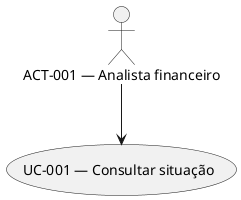
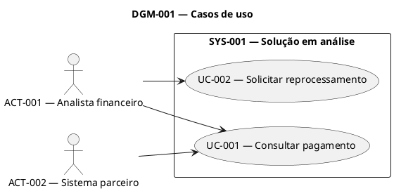
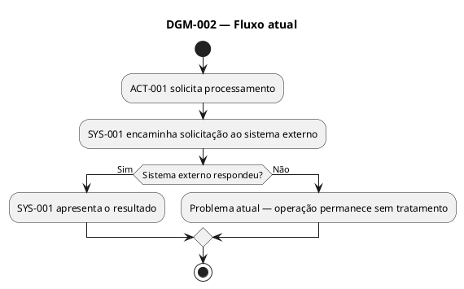
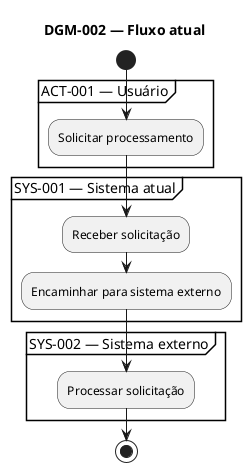
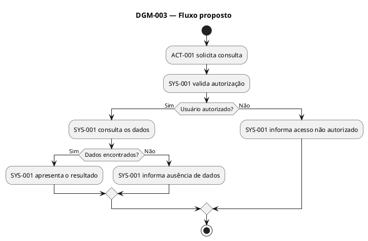
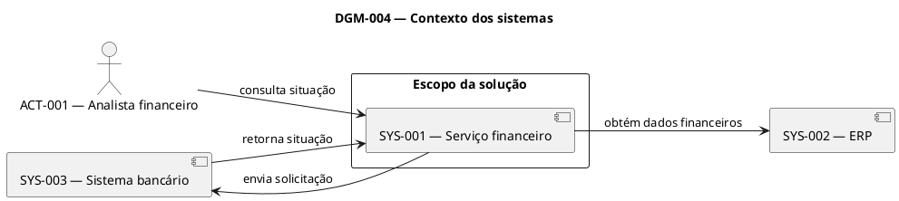
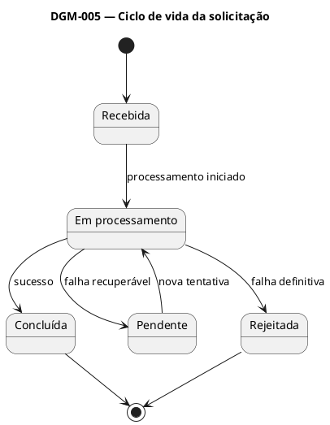

---

name: business-solution-modeling
description: Metodologia para transformar requisitos consolidados em visão funcional e visão macro de solução. Identifica atores, casos de uso, capacidades, fluxos As-Is e To-Be, sistemas, fronteiras, responsabilidades, integrações, dados e impactos. Produz exclusivamente diagramas PlantUML em arquivos .puml compatíveis com visualização no IntelliJ e preparados para inserção no draw.io.
-----------------------------------------------------------------------------------------------------------------------------------------------------------------------------------------------------------------------------------------------------------------------------------------------------------------------------------------------------------------------------------------------------

# Objetivo

Transformar uma baseline consolidada de requisitos em um modelo que explique:

* quem utiliza ou participa da solução;
* quais capacidades serão disponibilizadas;
* quais casos de uso estão envolvidos;
* como o processo funciona;
* quais sistemas participam;
* quais responsabilidades pertencem a cada sistema;
* quais dados atravessam os limites;
* quais impactos e dúvidas existem.

O modelo deve ser compreensível sem conhecimento do código.

# Artefatos obrigatórios

Utilize o template:

`business-solution-model-template.md`

Produza ou atualize:

`docs/ai-dlc/work-items/<work-item-id>/business-solution-model.md`

Produza os diagramas em:

`docs/ai-dlc/work-items/<work-item-id>/diagrams/`

Arquivos obrigatórios:

* `01-use-cases.puml`
* `03-to-be-activity.puml`
* `04-system-context.puml`

Arquivos condicionais:

* `02-as-is-activity.puml`
* `05-state-lifecycle.puml`
* `06-data-flow-impact.puml`

Quando o usuário indicar outro caminho, utilize o caminho informado.

# Princípio central

O modelo deve reduzir ambiguidade, não escondê-la.

Quando uma informação estiver ausente:

* não invente;
* não escolha arbitrariamente;
* registre a lacuna;
* crie uma pergunta;
* identifique o impacto.

Um diagrama incompleto com uma dúvida explícita é melhor que um diagrama
completo baseado em suposições.

# Padrão obrigatório de diagramas

Todos os diagramas devem utilizar PlantUML.

Cada diagrama deve:

1. possuir um arquivo `.puml`;
2. começar com `@startuml`;
3. terminar com `@enduml`;
4. possuir um identificador `DGM-###`;
5. possuir um título;
6. possuir aliases estáveis;
7. apontar para requisitos;
8. possuir uma cópia idêntica no Markdown;
9. utilizar somente o perfil conservador definido nesta skill.

É proibido utilizar Mermaid.

# Fonte canônica e sincronização

O arquivo `.puml` é a fonte canônica.

O bloco PlantUML dentro do `business-solution-model.md` é uma cópia para
visualização.

Após qualquer alteração:

1. atualize o `.puml`;
2. copie exatamente o conteúdo para o bloco PlantUML correspondente;
3. confirme que não existem linhas divergentes;
4. atualize a descrição textual;
5. atualize a rastreabilidade;
6. registre a mudança no histórico.

Se houver divergência, considere o `.puml` como fonte oficial e corrija
o Markdown.

# Perfil conservador para IntelliJ e draw.io

Utilize apenas construções básicas e amplamente reconhecidas.

Permitido:

* atores;
* casos de uso;
* componentes;
* retângulos;
* packages;
* atividades;
* decisões;
* repetições simples;
* paralelismo simples;
* partitions;
* estados;
* notas simples;
* relações e setas simples;
* títulos;
* direções de layout.

Proibido:

* includes locais;
* includes remotos;
* bibliotecas;
* C4-PlantUML;
* macros;
* funções;
* variáveis de preprocessamento;
* temas;
* sprites;
* ícones;
* fontes externas;
* hyperlinks;
* HTML;
* sintaxe experimental;
* layouts dependentes de plugins;
* customização visual complexa.

Não use cor como única forma de transmitir informação.

Não dependa de customização estética para diferenciar:

* confirmado;
* candidato;
* externo;
* interno;
* bloqueado.

Utilize texto explícito.

# Convenção de nomes PlantUML

IDs documentais utilizam hífen:

* `ACT-001`
* `UC-001`
* `SYS-001`

Aliases PlantUML utilizam underscore:

* `ACT_001`
* `UC_001`
* `SYS_001`

Exemplo:



Nunca utilize o texto visível como alias.

# Pré-condições

Antes de iniciar:

1. localize o `requirements-analysis.md`;
2. confirme o `work-item-id`;
3. verifique o status;
4. verifique `handoff_ready`;
5. identifique requisitos;
6. identifique histórias;
7. identifique critérios de aceite;
8. identifique perguntas abertas;
9. identifique conflitos;
10. identifique fontes complementares.

Quando os requisitos não estiverem validados, registre:

* status da baseline;
* motivo da modelagem antecipada;
* itens provisórios;
* riscos;
* condição que impede o handoff.

# Processo de modelagem

## Passo 1 — Inventariar as fontes

Registre:

* baseline de requisitos;
* análises de reunião consultadas;
* documentação do sistema atual;
* protótipos;
* imagens;
* diagramas existentes;
* decisões;
* código consultado;
* correções do usuário.

Para cada fonte, registre:

* identificador;
* tipo;
* caminho ou nome;
* status;
* autoridade;
* finalidade;
* observações.

## Passo 2 — Identificar atores

Identifique:

* usuários;
* perfis;
* áreas;
* equipes;
* operadores;
* administradores;
* aprovadores;
* sistemas que iniciam ações;
* sistemas que recebem resultados;
* consumidores externos.

Para cada ator, registre:

* ID;
* nome;
* tipo;
* objetivo;
* participação no fluxo;
* capacidades utilizadas;
* restrições;
* fonte.

Não crie dois atores apenas porque fontes diferentes usam nomes parecidos.

Quando a equivalência não estiver confirmada, crie uma pergunta.

## Passo 3 — Identificar capacidades

Uma capacidade descreve algo que um ator precisa conseguir realizar.

Exemplos:

* consultar títulos;
* visualizar situação de pagamento;
* solicitar reprocessamento;
* aprovar uma solicitação;
* receber uma notificação;
* consultar o motivo de rejeição.

Uma capacidade deve:

* possuir resultado reconhecível;
* estar ligada a um ator;
* estar ligada a requisitos;
* evitar detalhes de implementação.

Não utilize como capacidade:

* chamar endpoint;
* executar use case;
* persistir em tabela;
* publicar em Kafka;
* validar DTO;
* executar controller.

## Passo 4 — Identificar casos de uso

Cada caso de uso deve representar uma interação relevante entre um ator e
a solução.

Para cada caso de uso, registre:

* ID;
* nome;
* ator principal;
* atores secundários;
* objetivo;
* pré-condições de negócio;
* resultado esperado;
* requisitos relacionados;
* perguntas relacionadas;
* status.

Status permitidos:

* `Confirmed`
* `Candidate`
* `Superseded`
* `Rejected`

Não transforme cada tela, botão ou endpoint em caso de uso.

## Passo 5 — Criar o diagrama de casos de uso

Arquivo:

`01-use-cases.puml`

Tipo:

UML Use Case Diagram.

O diagrama deve mostrar:

* atores externos;
* fronteira da solução;
* casos de uso;
* relações entre atores e casos de uso;
* relações `include` ou `extend` somente quando confirmadas.

Estrutura recomendada:



Não represente componentes técnicos neste diagrama.

## Passo 6 — Determinar se o As-Is é necessário

Crie o fluxo atual quando:

* a demanda corrige um problema atual;
* existe substituição de sistema;
* existe migração;
* uma responsabilidade mudará;
* um comportamento atual precisa ser preservado;
* existe risco de regressão;
* o To-Be depende da compreensão do estado atual.

Quando não for necessário, registre a justificativa.

## Passo 7 — Criar o fluxo As-Is

Arquivo:

`02-as-is-activity.puml`

Tipo:

UML Activity Diagram.

Identifique:

* evento inicial;
* ator inicial;
* atividades;
* decisões;
* sistemas;
* resultado atual;
* problemas;
* falhas;
* etapas manuais.

Estrutura recomendada:



Quando utilizar `partition`, mantenha o fluxo simples:



## Passo 8 — Criar o fluxo To-Be

Arquivo:

`03-to-be-activity.puml`

Tipo:

UML Activity Diagram.

Esse diagrama é obrigatório.

Identifique:

* evento inicial;
* ator que inicia;
* pré-condições;
* atividades observáveis;
* decisões;
* regras que alteram o caminho;
* sistemas envolvidos;
* exceções;
* resultado final;
* retorno ao usuário ou sistema chamador.

O fluxo deve representar comportamento funcional, não implementação.

Evite:

`Controller chama use case.`

Prefira:

`Sistema recebe a solicitação e valida a autorização.`

Exemplo:



Quando uma etapa depender de pergunta:

```text
A confirmar — MOD-QST-003
```

Não esconda a pendência.

## Passo 9 — Identificar o sistema em foco

Determine:

* nome;
* responsabilidade atual;
* responsabilidade futura;
* o que está dentro da fronteira;
* o que está fora;
* fontes;
* perguntas.

Não confunda:

* repositório;
* aplicação;
* módulo;
* serviço;
* sistema;
* plataforma;
* produto;
* equipe.

Quando houver ambiguidade, crie pergunta.

## Passo 10 — Identificar sistemas externos

Para cada sistema externo, registre:

* ID;
* nome;
* responsabilidade;
* relação com a solução;
* informações enviadas;
* informações recebidas;
* direção da interação;
* comportamento esperado;
* propriedade dos dados;
* fonte.

Um sistema é externo quando sua implementação não faz parte da fronteira
analisada, mesmo que pertença à mesma empresa.

## Passo 11 — Criar o contexto dos sistemas

Arquivo:

`04-system-context.puml`

Tipo:

UML Component Diagram em nível macro.

O diagrama deve mostrar:

* atores relevantes;
* fronteira da solução;
* sistema em foco;
* sistemas externos;
* interações;
* dados ou finalidade das interações.

Exemplo:



Toda relação deve possuir um significado.

Evite:

```text
SYS-001 --> SYS-002
```

Prefira:

```text
SYS-001 --> SYS-002 : consulta dados financeiros
```

Não represente classes ou componentes internos.

## Passo 12 — Identificar responsabilidades

Para cada responsabilidade, determine:

* ID;
* ator ou sistema responsável;
* entrada necessária;
* resultado produzido;
* dependências;
* requisitos;
* dúvidas.

Exemplos macro:

* receber solicitação;
* validar permissão;
* registrar operação;
* encaminhar processamento;
* consultar situação;
* notificar resultado;
* manter histórico;
* disponibilizar dados.

Quando duas partes aparentarem possuir a mesma responsabilidade:

1. registre conflito;
2. crie pergunta;
3. não duplique silenciosamente.

## Passo 13 — Identificar integrações

Para cada interação, registre:

* origem;
* destino;
* finalidade;
* dado ou evento;
* momento no fluxo;
* sucesso esperado;
* comportamento de falha;
* requisitos;
* perguntas.

Não invente:

* método HTTP;
* endpoint;
* tópico;
* fila;
* payload;
* timeout;
* quantidade de tentativas;
* protocolo.

Esses detalhes pertencem a etapas posteriores, salvo quando forem requisitos
já aprovados.

## Passo 14 — Identificar propriedade dos dados

Para cada grupo de dados, determine:

* ID;
* nome;
* sistema de origem;
* fonte oficial;
* consumidores;
* momento de criação;
* momento de atualização;
* sensibilidade;
* requisitos;
* perguntas.

Diferencie:

* sistema de origem;
* fonte oficial;
* cópia;
* consumidor;
* sistema que apenas apresenta o dado.

Quando a fonte oficial não estiver clara, crie pergunta bloqueante quando
isso puder alterar a solução.

## Passo 15 — Criar diagrama de estados quando necessário

Arquivo:

`05-state-lifecycle.puml`

Tipo:

UML State Diagram.

Crie quando houver:

* ciclo de vida;
* mudança de status;
* processamento assíncrono;
* aprovação;
* rejeição;
* cancelamento;
* reprocessamento;
* expiração.

Exemplo:



Não crie estados sem sustentação nos requisitos.

## Passo 16 — Criar fluxo de dados ou impacto quando necessário

Arquivo:

`06-data-flow-impact.puml`

Esse diagrama é condicional.

Use quando for necessário explicar:

* origem e destino dos dados;
* consumidores;
* replicação;
* fonte oficial;
* áreas impactadas;
* dependências relevantes.

Utilize diagrama de componentes ou atividade simples.

Não utilize notação experimental.

## Passo 17 — Identificar impactos

Avalie impactos sobre:

* sistemas;
* integrações;
* usuários;
* equipes;
* processos;
* dados;
* permissões;
* segurança;
* auditoria;
* observabilidade;
* operação;
* suporte;
* ambientes;
* consumidores externos.

Para cada impacto, registre:

* ID;
* categoria;
* item afetado;
* descrição;
* severidade;
* motivo;
* responsável por validar;
* requisitos.

O agente identifica impactos.

Ele não cria tarefas para tratá-los.

## Passo 18 — Modelar alternativas

Quando houver mais de uma solução macro:

1. crie `OPT-###`;
2. descreva cada alternativa;
3. compare responsabilidades;
4. compare impacto;
5. compare riscos;
6. compare dependências;
7. registre requisitos atendidos;
8. crie pergunta de decisão;
9. não escolha sem aprovação.

Não transforme a comparação em design técnico detalhado.

## Passo 19 — Criar perguntas de modelagem

Utilize:

`MOD-QST-###`

Crie perguntas quando houver:

* ator ausente;
* responsabilidade ambígua;
* sistema desconhecido;
* fronteira indefinida;
* fluxo incompleto;
* fonte oficial de dados desconhecida;
* conflito;
* exceção sem comportamento definido;
* alternativa sem decisão;
* divergência entre As-Is e To-Be.

Cada pergunta deve ser:

* específica;
* atômica;
* respondível;
* contextualizada;
* ligada a elementos afetados.

Prioridades:

* `P0`: impede definir fluxo ou fronteira principal;
* `P1`: pode alterar sistema, responsabilidade ou integração;
* `P2`: melhora precisão;
* `P3`: detalhe não bloqueante.

## Passo 20 — Criar rastreabilidade

Todo ator deve apontar para uma fonte.

Todo caso de uso deve apontar para requisitos.

Toda capacidade deve apontar para requisitos.

Toda etapa do To-Be deve apontar para requisitos ou histórias.

Toda interação deve apontar para requisito de integração.

Toda pergunta deve indicar elementos afetados.

Todo diagrama deve indicar requisitos representados.

A matriz deve permitir responder:

* Qual requisito originou este caso de uso?
* Qual ator utiliza esta capacidade?
* Qual sistema possui esta responsabilidade?
* Qual pergunta pode alterar este diagrama?
* Qual história depende desta interação?

# Verificação PlantUML

Antes de concluir cada diagrama, verifique:

* existe exatamente um `@startuml`;
* existe exatamente um `@enduml`;
* `@startuml` aparece antes de `@enduml`;
* aliases são únicos;
* aliases não possuem espaços;
* aliases não possuem acentos;
* aliases não começam com números;
* relações apontam para aliases existentes;
* o diagrama possui título;
* não existe Mermaid;
* não existe `!include`;
* não existe `!includeurl`;
* não existem macros;
* não existem temas;
* não existem sprites;
* não existem URLs;
* não existe HTML;
* não existe C4-PlantUML;
* não existem elementos técnicos indevidos;
* o código do `.puml` é idêntico ao bloco no Markdown.

# Verificação semântica

Verifique:

* atores usam o mesmo nome em todo o documento;
* sistemas mantêm a mesma classificação;
* casos de uso existem no texto e no diagrama;
* relações possuem significado;
* fluxos possuem início;
* fluxos possuem resultado;
* decisões possuem caminhos claros;
* hipóteses estão identificadas;
* perguntas bloqueantes estão visíveis;
* nenhum diagrama contradiz a baseline;
* nenhuma seta cria uma responsabilidade não documentada;
* nenhum diagrama ultrapassa o nível macro.

# Complexidade dos diagramas

Como referência, evite mais de quinze elementos principais em um único
diagrama.

Quando o desenho ficar complexo:

1. mantenha uma visão geral;
2. divida o fluxo em diagramas menores;
3. preserve os mesmos IDs;
4. explique a relação entre os desenhos;
5. não aumente a complexidade apenas para caber tudo em um arquivo.

# Cálculo da prontidão

Use `clarification-required` quando houver:

* pergunta P0;
* fronteira principal indefinida;
* sistema responsável desconhecido;
* conflito crítico;
* To-Be incompleto;
* ator principal desconhecido;
* baseline essencial ainda não validada.

Use `ready-for-validation` quando:

* atores estiverem identificados;
* casos de uso estiverem definidos;
* capacidades estiverem mapeadas;
* To-Be estiver completo;
* contexto dos sistemas estiver definido;
* fronteiras estiverem explícitas;
* impactos estiverem registrados;
* arquivos `.puml` existirem;
* Markdown e `.puml` estiverem sincronizados;
* perguntas bloqueantes estiverem resolvidas.

Use `validated` somente após aprovação explícita.

Defina `handoff_ready: true` somente quando:

* status for `validated`;
* baseline estiver validada;
* baseline estiver pronta para handoff;
* não houver pergunta P0;
* não houver conflito crítico;
* os três diagramas obrigatórios existirem;
* PlantUML estiver consistente;
* rastreabilidade estiver consistente.

# Atualização incremental

Ao aplicar ajustes:

* preserve IDs;
* altere somente elementos impactados;
* atualize texto, tabelas e diagramas;
* atualize o `.puml`;
* atualize a cópia no Markdown;
* não perca perguntas ou decisões;
* incremente a revisão;
* registre a alteração;
* reabra o artefato quando uma premissa validada mudar.

# Economia de contexto

Não copie integralmente o `requirements-analysis.md`.

Não replique todos os critérios de aceite.

Utilize referências:

* `FR-001`;
* `BR-003`;
* `US-002`;
* `INT-001`.

No modelo, mantenha somente o necessário para compreender:

* atores;
* casos de uso;
* capacidades;
* fluxos;
* fronteiras;
* sistemas;
* responsabilidades;
* dados;
* impactos.

No chat, apresente somente:

* caminho;
* revisão;
* status;
* arquivos `.puml`;
* mudanças;
* perguntas prioritárias;
* condição de handoff.
