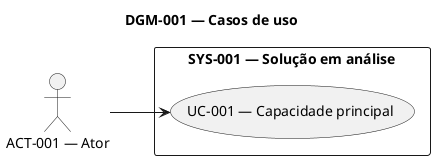
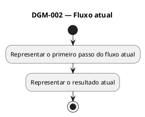
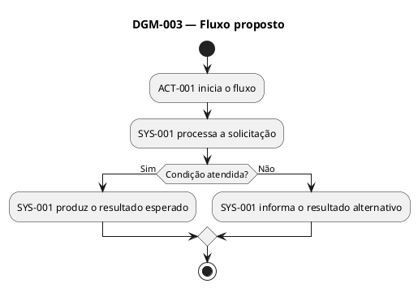
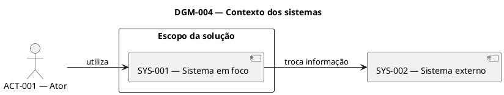
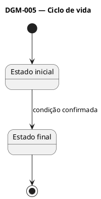
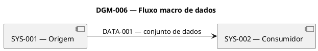

---

artifact_type: business-solution-model
schema_version: "2.0"
work_item_id: "<work-item-id>"
title: "<título da demanda>"
status: "draft"
revision: 1
handoff_ready: false
requirements_baseline: "<caminho do requirements-analysis.md>"
requirements_baseline_status: "<status>"
requirements_baseline_revision: "<revisão>"
project: "<projeto ou não informado>"
system_in_focus: "<sistema ou não definido>"
diagram_standard: "PlantUML"
diagram_source_of_truth: "separate-puml-files"
drawio_compatibility_profile: "conservative"
source_files: []
diagram_files: []
created_by: "Business and Solution Modeler"
created_at: "<data/hora ou não informado>"
updated_at: "<data/hora ou não informado>"
validated_by: null
validated_at: null
------------------

# Modelo de negócio e solução — <título>

## 1. Situação da modelagem

* Work item: `<work-item-id>`
* Status: `<draft | clarification-required | ready-for-validation | validated>`
* Revisão: `<número>`
* Baseline dos requisitos: `<caminho>`
* Status dos requisitos: `<status>`
* Revisão dos requisitos: `<revisão>`
* Padrão dos diagramas: `PlantUML`
* Perguntas abertas: `<quantidade>`
* Perguntas bloqueantes: `<quantidade>`
* Conflitos abertos: `<quantidade>`
* Pronto para handoff: `<sim ou não>`

## 2. Visão executiva

### Problema

<Problema que motivou a solução.>

### Objetivo

<Resultado de negócio esperado.>

### Solução em uma frase

<Descrição macro da solução, sem detalhes internos de implementação.>

### Principais mudanças

* <mudança relevante>
* <mudança relevante>

### Principais impactos

* <impacto relevante>
* <impacto relevante>

## 3. Fontes utilizadas

| ID      | Fonte             | Tipo   | Status   | Finalidade           | Observações  |
| ------- | ----------------- | ------ | -------- | -------------------- | ------------ |
| SRC-001 | <caminho ou nome> | <tipo> | <status> | <como foi utilizada> | <observação> |

## 4. Escopo da modelagem

### Dentro do escopo

* <item>

### Fora do escopo

* <item explicitamente excluído>

### Limites ainda não definidos

* <limite associado a MOD-QST-###>

## 5. Atores

| ID      | Ator   | Tipo                       | Objetivo   | Participação   | Requisitos | Fontes    |
| ------- | ------ | -------------------------- | ---------- | -------------- | ---------- | --------- |
| ACT-001 | <ator> | Usuário / Equipe / Sistema | <objetivo> | <participação> | <FR/BR/US> | <SRC-###> |

## 6. Capacidades

| ID      | Capacidade   | Atores    | Resultado esperado | Sistema responsável      | Status                | Requisitos |
| ------- | ------------ | --------- | ------------------ | ------------------------ | --------------------- | ---------- |
| CAP-001 | <capacidade> | <ACT-###> | <resultado>        | <SYS-### ou a confirmar> | Confirmed / Candidate | <FR/US>    |

## 7. Casos de uso

| ID     | Caso de uso   | Ator principal | Atores secundários  | Objetivo   | Resultado   | Status                | Requisitos | Perguntas                |
| ------ | ------------- | -------------- | ------------------- | ---------- | ----------- | --------------------- | ---------- | ------------------------ |
| UC-001 | <caso de uso> | <ACT-###>      | <ACT-### ou nenhum> | <objetivo> | <resultado> | Confirmed / Candidate | <FR/US>    | <MOD-QST-### ou nenhuma> |

## 8. Manifesto dos diagramas

| ID      | Diagrama              | Tipo PlantUML        | Obrigatório | Arquivo canônico                    | Status                 | Requisitos representados |
| ------- | --------------------- | -------------------- | ----------- | ----------------------------------- | ---------------------- | ------------------------ |
| DGM-001 | Casos de uso          | Use Case             | Sim         | `diagrams/01-use-cases.puml`        | Draft                  | <FR/US>                  |
| DGM-002 | Fluxo atual           | Activity             | Condicional | `diagrams/02-as-is-activity.puml`   | Not applicable / Draft | <FR/BR>                  |
| DGM-003 | Fluxo proposto        | Activity             | Sim         | `diagrams/03-to-be-activity.puml`   | Draft                  | <FR/BR/US>               |
| DGM-004 | Contexto dos sistemas | Component            | Sim         | `diagrams/04-system-context.puml`   | Draft                  | <FR/INT>                 |
| DGM-005 | Ciclo de vida         | State                | Condicional | `diagrams/05-state-lifecycle.puml`  | Not applicable / Draft | <FR/BR>                  |
| DGM-006 | Dados ou impactos     | Component / Activity | Condicional | `diagrams/06-data-flow-impact.puml` | Not applicable / Draft | <DATA/INT/NFR>           |

## 9. Diagramas PlantUML

### 9.1 DGM-001 — Casos de uso

**Objetivo**

Mostrar como atores externos interagem com as funcionalidades expostas
pela solução.

**Arquivo canônico**

`diagrams/01-use-cases.puml`

**Requisitos representados**

`<FR-###, US-###>`

**Perguntas que podem alterar o diagrama**

`<MOD-QST-### ou nenhuma>`

**Preview PlantUML**

O bloco abaixo deve ser uma cópia exata do arquivo canônico.

### 9.2 DGM-002 — Fluxo atual — As-Is

**Aplicabilidade**

`<Aplicável ou não aplicável — justificativa>`

**Arquivo canônico**

`diagrams/02-as-is-activity.puml`

**Problemas atuais representados**

* <problema>
* <problema>

**Requisitos ou fontes relacionados**

`<SRC-###, FR-###, BR-###>`

**Preview PlantUML**

Quando não aplicável, remova o bloco PlantUML e registre a justificativa.

### 9.3 DGM-003 — Fluxo proposto — To-Be

**Objetivo**

Mostrar o comportamento funcional esperado, suas decisões e resultados.

**Arquivo canônico**

`diagrams/03-to-be-activity.puml`

**Requisitos representados**

`<FR-###, BR-###, US-###>`

**Perguntas que podem alterar o diagrama**

`<MOD-QST-### ou nenhuma>`

**Preview PlantUML**

O bloco abaixo deve ser uma cópia exata do arquivo canônico.

### 9.4 DGM-004 — Contexto dos sistemas

**Objetivo**

Mostrar o sistema em foco, os atores, os sistemas externos, as fronteiras
e as interações macro.

**Arquivo canônico**

`diagrams/04-system-context.puml`

**Requisitos representados**

`<FR-###, INT-###>`

**Perguntas que podem alterar o diagrama**

`<MOD-QST-### ou nenhuma>`

**Preview PlantUML**

O bloco abaixo deve ser uma cópia exata do arquivo canônico.

### 9.5 DGM-005 — Estados ou ciclo de vida

**Aplicabilidade**

`<Aplicável ou não aplicável — justificativa>`

**Arquivo canônico**

`diagrams/05-state-lifecycle.puml`

**Entidade ou processo modelado**

`<entidade, solicitação, pagamento etc.>`

**Requisitos representados**

`<FR-###, BR-###>`

**Preview PlantUML**

Quando não aplicável, remova o bloco e registre a justificativa.

### 9.6 DGM-006 — Fluxo de dados ou mapa de impacto

**Aplicabilidade**

`<Aplicável ou não aplicável — justificativa>`

**Arquivo canônico**

`diagrams/06-data-flow-impact.puml`

**Objetivo**

<Explicação do aspecto adicional representado.>

**Requisitos representados**

`<DATA-###, INT-###, NFR-###>`

**Preview PlantUML**

Quando não aplicável, remova o bloco e registre a justificativa.

## 10. Fluxos funcionais

### FLOW-001 — <nome do fluxo>

* Status: `<Confirmed | Candidate | Superseded>`
* Ator inicial: `<ACT-###>`
* Evento inicial: `<evento>`
* Resultado esperado: `<resultado>`
* Requisitos: `<FR/BR/US>`
* Diagrama relacionado: `<DGM-###>`
* Perguntas: `<MOD-QST-### ou nenhuma>`

| Ordem | Ator ou sistema | Atividade ou decisão  | Entrada   | Resultado   | Requisitos |
| ----- | --------------- | --------------------- | --------- | ----------- | ---------- |
| 1     | <ACT/SYS>       | <atividade funcional> | <entrada> | <resultado> | <FR/BR>    |
| 2     | <ACT/SYS>       | <atividade funcional> | <entrada> | <resultado> | <FR/BR>    |

### Exceções do fluxo

| ID      | Condição   | Comportamento esperado | Requisitos | Situação              |
| ------- | ---------- | ---------------------- | ---------- | --------------------- |
| EXC-001 | <condição> | <comportamento>        | <FR/BR/AC> | Confirmed / Candidate |

## 11. Sistemas e fronteiras

| ID      | Sistema           | Classificação | Responsabilidade macro | Dentro do escopo de implementação | Fontes    |
| ------- | ----------------- | ------------- | ---------------------- | --------------------------------- | --------- |
| SYS-001 | <sistema em foco> | Interno       | <responsabilidade>     | Sim                               | <SRC-###> |
| SYS-002 | <sistema externo> | Externo       | <responsabilidade>     | Não                               | <SRC-###> |

### Fronteira da solução

**Dentro da fronteira**

* <responsabilidade>

**Fora da fronteira**

* <responsabilidade externa>

**Fronteiras ainda ambíguas**

* <MOD-QST-### ou nenhum item>

## 12. Responsabilidades

| ID       | Responsabilidade   | Ator ou sistema responsável | Entrada   | Resultado   | Requisitos | Situação              |
| -------- | ------------------ | --------------------------- | --------- | ----------- | ---------- | --------------------- |
| RESP-001 | <responsabilidade> | <ACT/SYS>                   | <entrada> | <resultado> | <FR/BR>    | Confirmed / Candidate |

## 13. Interações e integrações macro

| ID      | Origem    | Destino   | Finalidade   | Dado ou evento   | Sucesso esperado | Falha esperada                 | Requisitos  | Perguntas     |
| ------- | --------- | --------- | ------------ | ---------------- | ---------------- | ------------------------------ | ----------- | ------------- |
| INT-001 | <SYS-###> | <SYS-###> | <finalidade> | <dado ou evento> | <resultado>      | <comportamento ou a confirmar> | <INT/FR/BR> | <MOD-QST-###> |

Não incluir endpoints, DTOs ou protocolos não confirmados.

## 14. Dados e propriedade

| ID       | Dado ou grupo | Sistema de origem | Fonte oficial            | Consumidores | Sensibilidade   | Requisitos   | Perguntas     |
| -------- | ------------- | ----------------- | ------------------------ | ------------ | --------------- | ------------ | ------------- |
| DATA-001 | <dado>        | <SYS-###>         | <SYS-### ou a confirmar> | <SYS-###>    | <classificação> | <DATA/FR/BR> | <MOD-QST-###> |

## 15. Impactos

| ID      | Categoria                                                  | Item impactado | Descrição | Severidade           | Motivo   | Responsável por validar | Requisitos  |
| ------- | ---------------------------------------------------------- | -------------- | --------- | -------------------- | -------- | ----------------------- | ----------- |
| IMP-001 | Sistema / Processo / Equipe / Dados / Segurança / Operação | <item>         | <impacto> | Alta / Média / Baixa | <motivo> | <equipe>                | <FR/BR/NFR> |

## 16. Alternativas macro de solução

### OPT-001 — <nome da opção>

* Status: `<Candidate | Selected | Rejected>`
* Descrição: <opção em alto nível>
* Benefícios:

    * <benefício>
* Riscos:

    * <risco>
* Dependências:

    * <dependência>
* Impactos:

    * <IMP-###>
* Requisitos atendidos:

    * <FR/BR/NFR>
* Pergunta de decisão:

    * <MOD-QST-###>

Utilize:

`Não aplicável — não foram identificadas alternativas relevantes.`

quando houver uma única direção aprovada.

## 17. Decisões da solução

| ID       | Decisão         | Status                                      | Decidida por       | Fonte   | Itens impactados       |
| -------- | --------------- | ------------------------------------------- | ------------------ | ------- | ---------------------- |
| SDEC-001 | <decisão macro> | Proposed / Approved / Superseded / Rejected | <pessoa ou equipe> | <fonte> | <SYS/FLOW/INT/OPT/DGM> |

## 18. Premissas

| ID      | Premissa   | Motivo   | Risco se incorreta | Itens impactados | Pergunta      |
| ------- | ---------- | -------- | ------------------ | ---------------- | ------------- |
| ASM-001 | <premissa> | <motivo> | <risco>            | <itens>          | <MOD-QST-###> |

Premissas não são decisões confirmadas.

## 19. Perguntas de modelagem

| ID          | Status | Prioridade | Bloqueante | Categoria | Pergunta   | Motivo e impacto | Itens afetados     | Quem pode responder | Destino                                       |
| ----------- | ------ | ---------- | ---------- | --------- | ---------- | ---------------- | ------------------ | ------------------- | --------------------------------------------- |
| MOD-QST-001 | Open   | P0         | Sim        | Fronteira | <pergunta> | <impacto>        | <SYS/FLOW/INT/DGM> | <equipe ou pessoa>  | Requirements Engineer / Arquitetura / Negócio |

Status permitidos:

* `Open`
* `Partially answered`
* `Answered`
* `Resolved`
* `Cancelled`

## 20. Conflitos de modelagem

| ID       | Descrição  | Fontes ou elementos   | Impacto   | Itens afetados | Pergunta      | Status                     |
| -------- | ---------- | --------------------- | --------- | -------------- | ------------- | -------------------------- |
| MCNF-001 | <conflito> | <fontes ou elementos> | <impacto> | <itens>        | <MOD-QST-###> | Open / Resolved / Accepted |

## 21. Matriz de rastreabilidade

| Elemento | Requisitos ou histórias | Fontes  | Perguntas   | Diagramas |
| -------- | ----------------------- | ------- | ----------- | --------- |
| UC-001   | FR-001, US-001          | SRC-001 | Nenhuma     | DGM-001   |
| FLOW-001 | FR-001, BR-002          | SRC-001 | MOD-QST-002 | DGM-003   |
| SYS-001  | INT-001                 | SRC-002 | MOD-QST-003 | DGM-004   |

## 22. Feedback para o Requirements Engineer

| ID      | Tipo                            | Descrição   | Requisitos afetados | Pergunta      | Ação recomendada                 |
| ------- | ------------------------------- | ----------- | ------------------- | ------------- | -------------------------------- |
| FBK-001 | Lacuna / Conflito / Ambiguidade | <descrição> | <FR/BR/US>          | <MOD-QST-###> | Revisar no Requirements Engineer |

O Business and Solution Modeler não deve alterar diretamente o dossiê
de requisitos.

## 23. Verificação dos arquivos PlantUML

| Verificação                                    | Resultado | Observação   |
| ---------------------------------------------- | --------- | ------------ |
| Todos os diagramas usam PlantUML               | Sim / Não | <observação> |
| Não existe Mermaid                             | Sim / Não | <observação> |
| Todos os `.puml` começam com `@startuml`       | Sim / Não | <observação> |
| Todos os `.puml` terminam com `@enduml`        | Sim / Não | <observação> |
| Aliases são únicos                             | Sim / Não | <observação> |
| Não existem includes ou bibliotecas externas   | Sim / Não | <observação> |
| Não existem temas, macros ou sprites           | Sim / Não | <observação> |
| `.puml` e bloco Markdown são idênticos         | Sim / Não | <observação> |
| Elementos possuem rastreabilidade              | Sim / Não | <observação> |
| Diagramas estão no nível macro                 | Sim / Não | <observação> |
| Perfil conservador para draw.io foi respeitado | Sim / Não | <observação> |

## 24. Condição para próxima etapa

* Baseline de requisitos validada: `<sim ou não>`
* Baseline pronta para handoff: `<sim ou não>`
* Diagrama de casos de uso concluído: `<sim ou não>`
* Fluxo To-Be concluído: `<sim ou não>`
* Contexto dos sistemas concluído: `<sim ou não>`
* Fronteiras principais definidas: `<sim ou não>`
* Perguntas P0 abertas: `<quantidade>`
* Perguntas P1 abertas: `<quantidade>`
* Conflitos críticos abertos: `<quantidade>`
* Arquivos `.puml` criados: `<sim ou não>`
* PlantUML válido visualmente: `<sim ou não>`
* `.puml` e Markdown sincronizados: `<sim ou não>`
* Diagramas consistentes com o texto: `<sim ou não>`
* Rastreabilidade verificada: `<sim ou não>`
* Artefato aprovado pelo usuário: `<sim ou não>`
* Pronto para handoff: `<sim ou não>`

### Bloqueios para handoff

* <MOD-QST-###, MCNF-### ou nenhum bloqueio>

### Observações para o Task Planner

* <informação útil para decomposição do trabalho>

### Observações para o Technical Designer

* <fronteiras, sistemas, integrações e riscos que deverão ser considerados>

## 25. Histórico de revisões

| Revisão | Data                    | Autor                         | Alteração                                         |
| ------- | ----------------------- | ----------------------------- | ------------------------------------------------- |
| 1       | <data ou não informada> | Business and Solution Modeler | Criação inicial do modelo e dos arquivos PlantUML |
